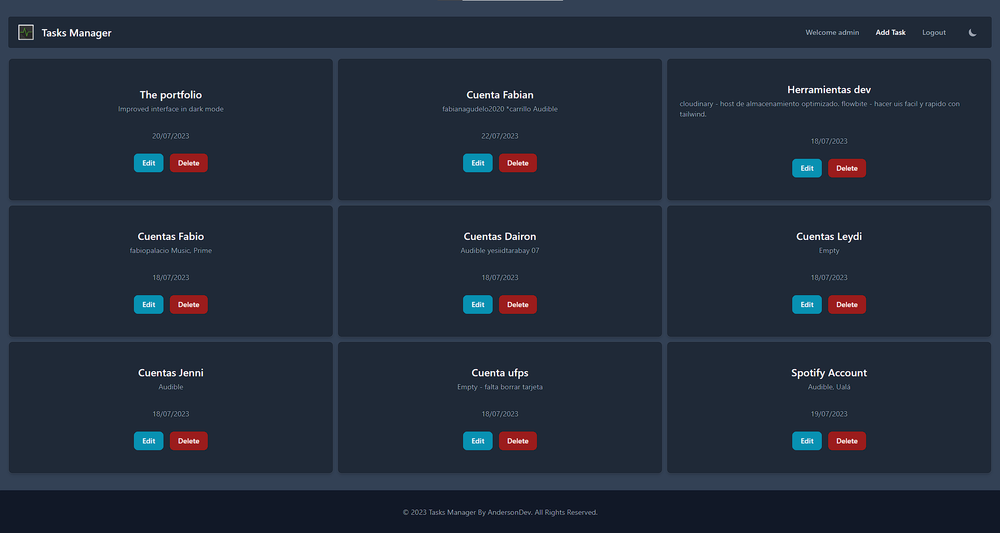

## Tasks Web - MERN Stack CRUD with JWT

Task website with login, and user registration using mongoDB, Express.js, and React.js

## Page Demo [(Free version)](https://tasks-app-express.netlify.app/)


## Development server

Run `npm run dev` for a dev server. Navigate to `http://localhost:5173/`. The application will automatically reload if you change any of the source files.

## Build

Run `npm run build` to build the project. The build artifacts will be stored in the `dist/` directory.

### Deployment

```sh
git clone https://github.com/Anderson0x07/tasks-auth.git
cd tasks-auth/
npm i
npm run dev
```

> You need to have a Mongodb database running
